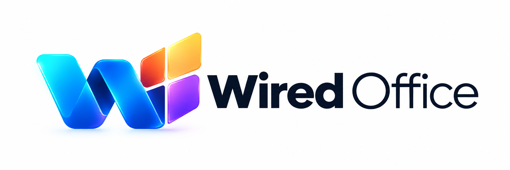

Wired Office

  

Wired Office is a cross-platform productivity suite for macOS, Windows, and Linux.
The goal is to build a modern, fast, consistent alternative to traditional office software, with a unified design language and apps that work well together across desktop platforms.
Overview
Wired Office is designed as a complete office ecosystem rather than a single application. Each app should feel familiar, focused, and easy to use while still sharing the same core experience.
The project is currently in active development.
Planned Apps
- Documents — Create and edit text documents
- Spreadsheets — Work with tables, formulas, charts, and structured data
- Presentations — Build and present slide decks
- Mail — Email and communication
- Teams-style communication — Messaging, calls, meetings, and collaboration
- Calendar — Events, meetings, and scheduling
- Notes — Fast personal and shared notes
- Files — Manage and organize Wired Office documents
The final set of applications may change as the project develops.
Core Goals
- Native-feeling experience on macOS, Windows, and Linux
- Clean and recognizable Wired Office design
- Fast startup and responsive performance
- Consistent UI and interaction patterns across all apps
- Strong interoperability between Wired Office applications
- Support for common office file formats
- Useful collaboration features
- Simple installation and updates
- Good keyboard and accessibility support
- Maintainable modular architecture
Design
Wired Office uses a modern visual identity built around the Wired Office brand.
The design direction focuses on:
- Professional but friendly visuals
- Clear typography
- Rounded, refined interface elements
- Strong icon recognition at both small and large sizes
- Consistent app identities within the same suite
- Light and dark interface support
Platforms
Wired Office is intended to support:
- macOS
- Windows
- Linux
Platform-specific behavior should be respected where it improves the user experience while keeping the overall product consistent.
Project Structure
The exact architecture is still evolving. A possible high-level structure is:
Wired-Office/
├── apps/
│   ├── documents/
│   ├── spreadsheets/
│   ├── presentations/
│   ├── mail/
│   ├── communication/
│   ├── calendar/
│   ├── notes/
│   └── files/
├── shared/
│   ├── ui/
│   ├── icons/
│   ├── themes/
│   ├── services/
│   └── core/
├── assets/
├── docs/
└── README.md
Development Status
Wired Office is currently under development and should be considered experimental.
Features, application names, architecture, and UI may change significantly before a stable release.
Contributing
Contribution guidelines will be added as the project matures.
For now, development should prioritize consistency, maintainability, performance, and compatibility across all supported platforms.
License
License information will be added here.
